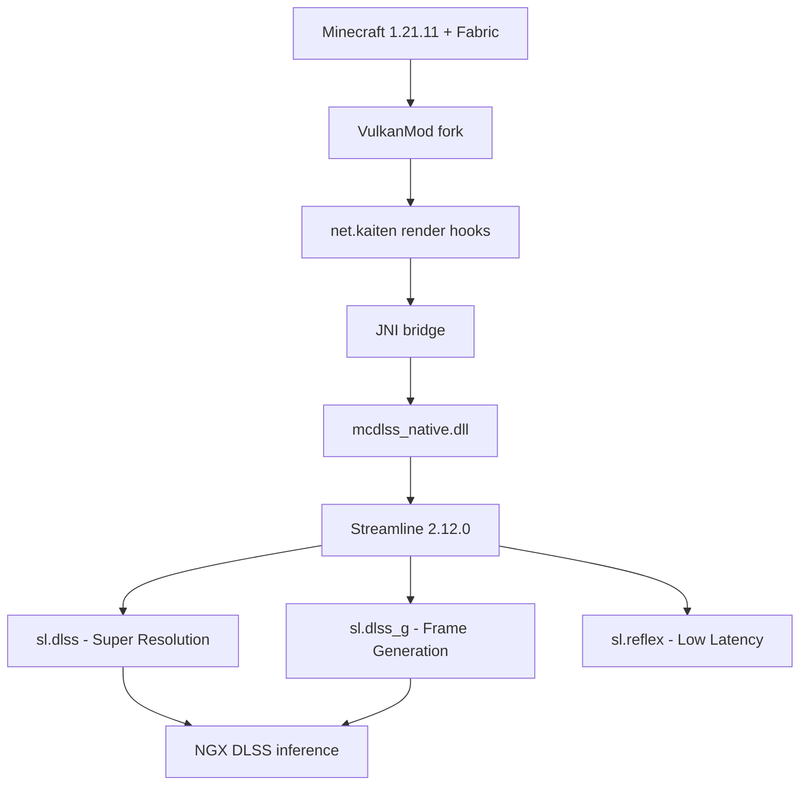

# Kaiten - DLSS 4 for Minecraft (VulkanMod fork)

**NVIDIA DLSS 4: Super Resolution + Frame Generation + Reflex** for Minecraft Java Edition 1.21.11, running on a VulkanMod fork.

> **⚠️ This is a personal development project.** It works on my RTX 5070 Ti at 2560×1600. Your mileage may vary. Not affiliated with NVIDIA or Mojang.

## What works NOW

| Feature | Status | Details |
|---------|--------|---------|
| **DLSS Super Resolution** | ✅ | DLAA (AI anti-aliasing) at native resolution. Evaluates on every frame, composites back into the swapchain. Live in-game. |
| **DLSS Frame Generation** | ✅ | Multi-Frame Gen (2×/3×/4×). Tags resources each frame, SL interposer injects interpolated frames at present. `status=0` verified across 178k+ frame sessions. |
| **Reflex** | ✅ | Low-latency mode active, PCL markers + sleep wired into frame loop. |
| **Settings UI** | ✅ | Full Kaiten tab in VulkanMod's Video Settings sidebar. DLSS on/off, quality preset, FG multiplier, Reflex mode. Per-GPU JSON profiles. |
| **Jitter + camera tracking** | ✅ | Halton(2,3) jitter, frame-to-frame view-projection capture, real-time vpDelta monitoring. |
| **Actual upscaling** | ⚠️ | DLAA only (AI-AA at native res, no performance boost). True lower-res → native upscaling needs a separate low-res render pass — that's the next step for the "FPS goes up" payoff. |



## Quick Start

Windows + RTX GPU + HAGS enabled. Portable toolchain (no admin beyond initial MSVC install).

```powershell
. .\tools\env.ps1                # JDK 21 + CMake on PATH
.\tools\build_native.ps1         # build mcdlss_native.dll
.\tools\run_dev.ps1              # launch Minecraft
```

Or from the `vulkanmod/` directory:

```powershell
gradle runClient
```

On launch you'll see:

```
[Render thread/INFO] (VulkanMod-DLSS) Loaded native library: ...\run\mcdlss\mcdlss_native.dll
[Render thread/INFO] (VulkanMod-DLSS) mcdlss_native 0.5.0 (Phase 5: DLSS Frame Generation)
[Render thread/INFO] (VulkanMod-DLSS)   DLSS Super Resolution: SUPPORTED
[Render thread/INFO] (VulkanMod-DLSS)   DLSS Frame Generation: SUPPORTED
[Render thread/INFO] (VulkanMod-DLSS)   Reflex: SUPPORTED
[Render thread/INFO] (VulkanMod-DLSS) [DLSS-SR] DLAA running at native 2560x1600 (AI anti-aliasing)
[Render thread/INFO] (VulkanMod-DLSS) [DLSS-G] Frame Generation running, 2560x1600
```

> **You must supply the NVIDIA binaries.** Download `streamline-sdk-v2.12.0.zip` from [NVIDIA-RTX/Streamline](https://github.com/NVIDIA-RTX/Streamline) releases. The `sl.dlss_g`, `nvngx_dlss*` DLLs are proprietary and **not** in this repo.

## Architecture

```
net.kaiten.DlssSuperResolution  ──  in-frame DLSS evaluate + composite
net.kaiten.DlssFrameGeneration  ──  FG resource tagging (present interception)
net.kaiten.DlssFrameState       ──  jitter, view-projection, camera tracking
net.kaiten.NativeBridge         ──  JNI spine (60+ native methods)
net.kaiten.config.KaitenConfig  ──  per-GPU JSON profiles
net.kaiten.config.KaitenOptions ──  VulkanMod sidebar settings

native/src/sl_dlss_sr.cpp       ──  slDLSSSetOptions, slAllocateResources, evaluate
native/src/sl_dlss_g.cpp        ──  slDLSSGSetOptions, tag, shared frame token
native/src/sl_manager.cpp       ──  slInit, feature queries, shutdown
native/src/sl_reflex.cpp        ──  Reflex sleep + PCL markers
```

## Requirements

- **OS:** Windows 10/11, HAGS **on** (Frame Gen requirement)
- **GPU:** RTX 20+ (SR), RTX 40+ (FG), RTX 50+ (3×/4× MFG). Vulkan 1.2+
- **JDK:** 21 (Temurin recommended)
- **Native:** CMake 4.0+ + MSVC Build Tools 2022
- Non-NVIDIA / missing-DLL setups → plain VulkanMod, DLSS unavailable

## Known Issues

- **SR: DLAA only.** No FPS boost until the low-res render pass is implemented. Quality presets in settings UI are recorded but force DLAA mode.
- **Shutdown crash.** `sl.common.dll` access violation during `slShutdown()` — Streamline SDK issue, not gameplay-affecting.
- **FG: numPresented=0.** Frame Generation works via present interception but the counter stays 0 (cosmetic).
- **No motion vectors.** MV pass currently passes a zero buffer — no per-pixel temporal reprojection yet.

## License

**LGPL-3.0** (VulkanMod fork). NVIDIA Streamline / NGX DLLs are proprietary, redistributed only as unmodified signed binaries under NVIDIA's license — see [THIRD_PARTY_NOTICES.md](THIRD_PARTY_NOTICES.md). Minecraft itself and Mojang mappings are not redistributed - the loader pulls those at build time under their own terms.
